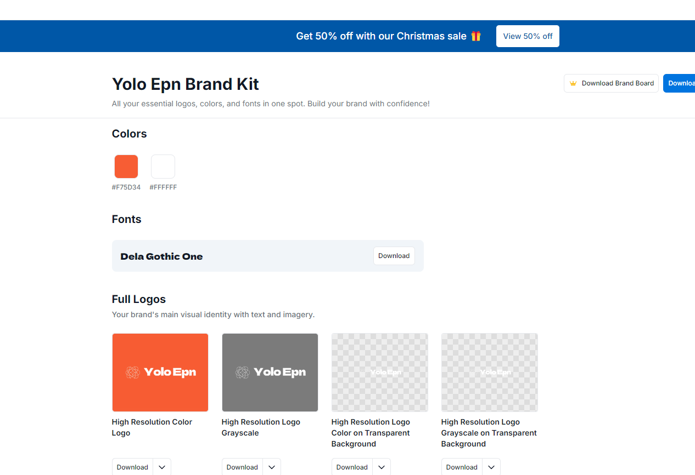
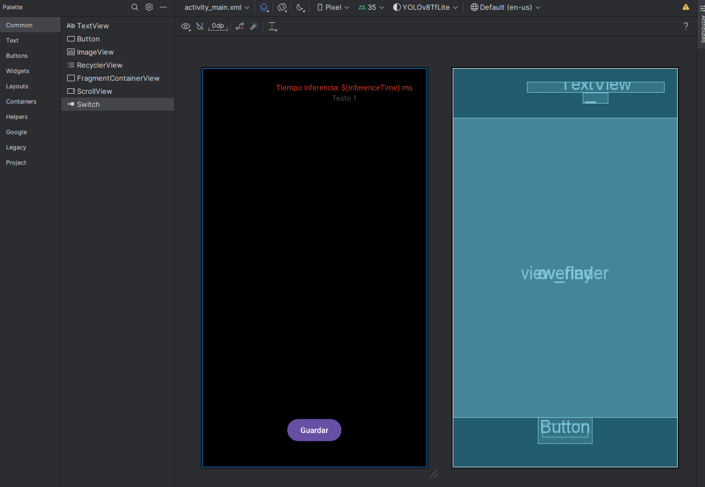
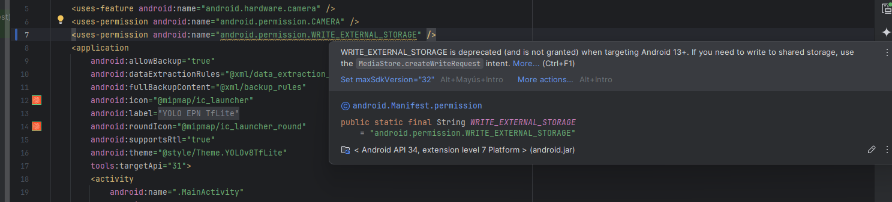
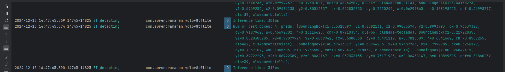

Logo creado de:

https://logo.com/dashboard/brand-kit

Intento grabar

Permisos nuevos

Hacer petición de permiso

Campos de la predicción

x1: The x-coordinate of the top-left corner of the bounding box.

y1: The y-coordinate of the top-left corner of the bounding box.

x2: The x-coordinate of the bottom-right corner of the bounding box.

y2: The y-coordinate of the bottom-right corner of the bounding box.

cx: The x-coordinate of the center of the bounding box.

cy: The y-coordinate of the center of the bounding box.

w: The width of the bounding box.

h: The height of the bounding box.

cnf: The confidence score of the detected object.

cls: The class ID of the detected object.

clsName: The name of the detected object's class.