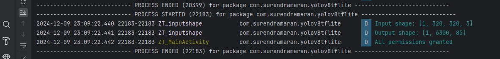
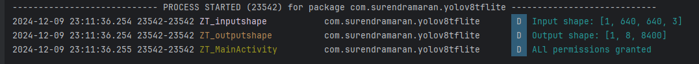
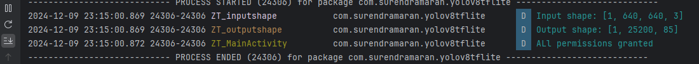
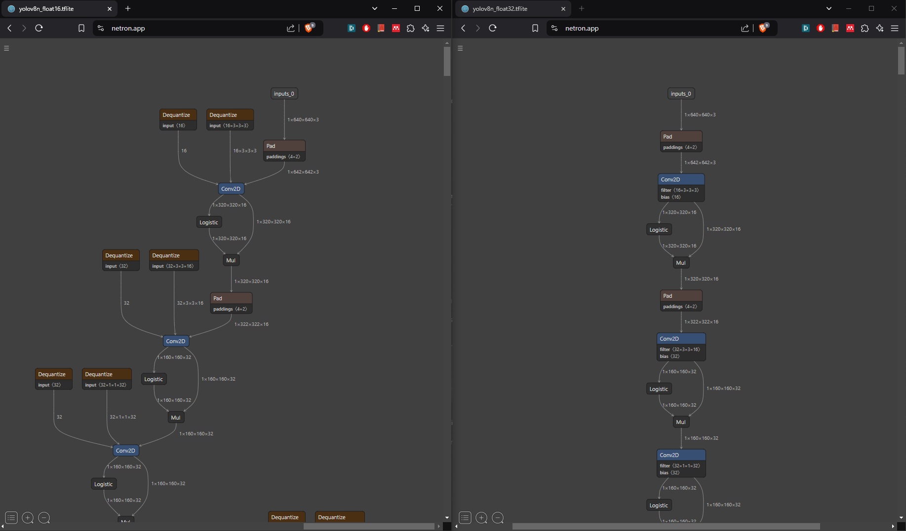
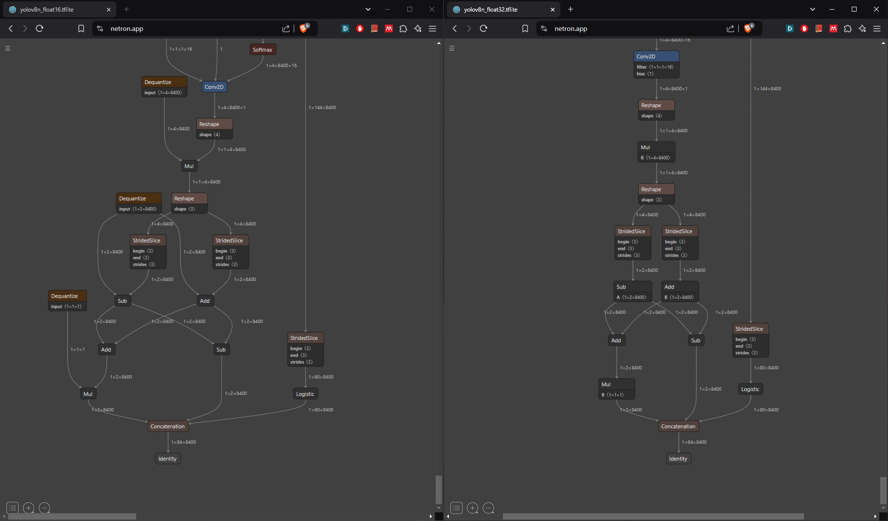

## experiments
* Using https://netron.app/ we can view the weights and architecture of the model

With the model found in web

With org model (forks)

With our model

Comparizon models

Compiled as v8
* Sligthly different input

* Same output

